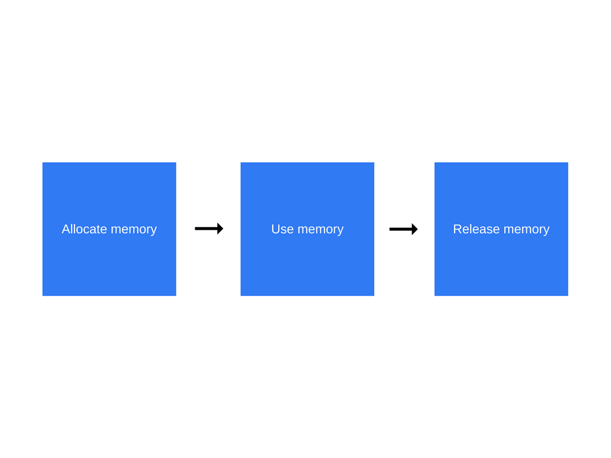

# Memory Leaks
 "A memory leak is a type of resource leak that occurs when a computer program incorrectly manages memory allocations in such a way that memory which is no longer needed is not released" from [Wikipedia](https://en.wikipedia.org/wiki/Memory_leak)

Basic [memory lifecycle](https://developer.mozilla.org/en-US/docs/Web/JavaScript/Memory_Management#Memory_life_cycle) in most languages:
1. Allocate the memory you need
2. Use the allocated memory (read, write)
3. Release the allocated memory when it is not needed anymore

## Javascript Memory Management
From the steps in the previous section, you may notice that in Javascript you don't explicitly allocate memory for your variables and such. You just create or initialize them.  

Behind the scenes the Javascript Engine is allocating this memory for you. This makes Javascript a language with automatic memory management.  

This also means that there needs to be something checking if memory allocated previously can be reclaimed. This is the garbage collector.  

All modern browsers come equipped with a mark-and-sweep garbage collector. This will periodically run, traversing from the global garbage collector root(s) (ex. window object) and marking what can be reached.  

Anything left unreachable, can be safely garbage collected. This does imply that in order for something to cleaned up, you have to make it unreachable (typically you won't have to consciously think about this though).

## Common memory leaks
Most common sources on the web:
- Unintentional global variables
- Event listeners
- Timers
- Detached DOM references

### Unintentional global variables

  See the Pen <a href="https://codepen.io/rcasto/pen/WmgpRj/">
  Unintentional Global Variable Memory Leak</a> by Richie (<a href="https://codepen.io/rcasto">@rcasto</a>)
  on <a href="https://codepen.io">CodePen</a>.

### Event listeners

### Timers

### Detached DOM references

### External dependencies

## Detecting/finding memory leaks
Chrome dev tools is an essential tool when trying to find memory leaks and knowing at least some of the basics towards using it can help. The most useful tools for detecting memory leaks within the dev tools are as follows:
- Performance profiler
- Heap snapshot comparison
- Allocation Timeline

### Performance Profiler

### Heap snapshot comparison

### Allocation Timeline

## Resources
- https://developers.google.com/web/tools/chrome-devtools/memory-problems/
- https://developer.mozilla.org/en-US/docs/Web/JavaScript/Memory_Management
- https://developer.mozilla.org/en-US/docs/Web/JavaScript/EventLoop
- https://en.wikipedia.org/wiki/Memory_leak
- https://en.wikipedia.org/wiki/Garbage_collection_(computer_science)
- https://en.wikipedia.org/wiki/Tracing_garbage_collection