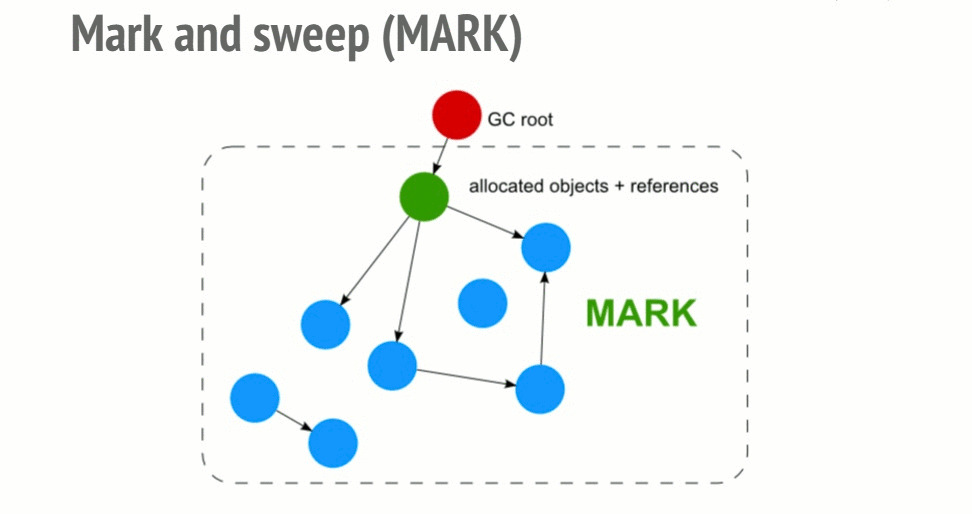
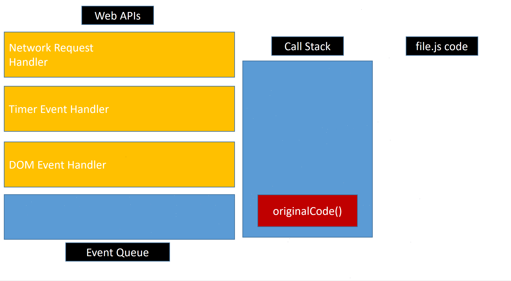

# Memory Leaks
 "A memory leak is a type of resource leak that occurs when a computer program incorrectly manages memory allocations in such a way that memory which is no longer needed is not released" from [Wikipedia](https://en.wikipedia.org/wiki/Memory_leak)

Basic [memory lifecycle](https://developer.mozilla.org/en-US/docs/Web/JavaScript/Memory_Management#Memory_life_cycle) in most languages:

## Javascript Memory Management
From the steps in the previous section, you may notice that in Javascript you don't explicitly allocate memory for your variables and such. You just create or initialize them.  

Behind the scenes the Javascript Engine is allocating this memory for you. This makes Javascript a language with automatic memory management.  

This also means that there needs to be something checking if memory allocated previously can be reclaimed. This is the garbage collector.  

All modern browsers come equipped with a mark-and-sweep garbage collector. This will periodically run, traversing from the global garbage collector root(s) (ex. window object) and marking what can be reached.  

Anything left unreachable, can be safely garbage collected. This does imply that in order for something to cleaned up, you have to make it unreachable (typically you won't have to consciously think about this though).

## Common memory leaks
- Unintentional global variables
- Event listeners
- Timers
- Detached DOM references

### Unintentional global variables
https://codepen.io/rcasto/pen/WmgpRj

**Rule of thumb:**  
Always declare a variable using `var`, `const`, or `let`.  
Always be certain of what the value assigned to the [`this`](https://developer.mozilla.org/en-US/docs/Web/JavaScript/Reference/Operators/this) context is.

### Timers
There are a few timer creators in Javascript, a timer could be created using any of the following:
- [setTimeout](https://devdocs.io/dom/windoworworkerglobalscope/settimeout)
- [setInterval](https://devdocs.io/dom/windoworworkerglobalscope/setinterval)
- [requestAnimationFrame](https://devdocs.io/dom/window/requestanimationframe)

Timers get added to the browser event loop, the conceptual model of this is as follows:  
  

https://codepen.io/rcasto/pen/ZPMJWr

**Rule of thumb:**   
Every setTimeout, setInterval, requestAnimationFrame should have a corresponding [clearTimeout](https://devdocs.io/dom/windoworworkerglobalscope/cleartimeout), [clearInterval](https://devdocs.io/dom/windoworworkerglobalscope/clearinterval), [cancelAnimationFrame](https://devdocs.io/dom/window/cancelanimationframe).

In [React](https://reactjs.org/) a good time to do this cleanup is in a components [`componentWillUnmount` lifecycle method](https://reactjs.org/docs/react-component.html#componentwillunmount).

### Event listeners
Event-driven programming is very common in Javascript and typically you will add event handlers to DOM nodes or otherwise utilizing `on*` handlers or [`addEventListener`](https://devdocs.io/dom/eventtarget/addeventlistener).

**Rule of thumb:**  
Remember to cleanup event handlers utilizing [`removeEventListener`](https://devdocs.io/dom/eventtarget/removeeventlistener).

In most modern browsers though, once the node has been detached from the DOM and all references removed the event handlers attached should also be cleaned up.

Also in most cases, at least in our code, we will be utilizing React to attach these handlers. It is the responsibility of React to then remove these event handler references as React is what translates the intermediate DOM objects to actual DOM nodes.

### Detached DOM references
When dealing with the DOM directly we often retain a reference to the DOM node in memory. This is especially prevalent when constructing the DOM entries from within Javascript.

https://codepen.io/rcasto/pen/aMayjx

**Rule of thumb**  
Remember to remove references to DOM nodes in Javascript that have been removed from the DOM tree.

## Detecting/finding memory leaks
[Chrome dev tools](https://developers.google.com/web/tools/chrome-devtools/) is an essential tool when trying to find memory leaks and knowing at least some of the basics of using it can help tremendously. The most useful tools for detecting memory leaks within the dev tools are as follows:
- [Performance profiler](https://developers.google.com/web/tools/chrome-devtools/evaluate-performance/)
- [Heap snapshot comparison](https://developers.google.com/web/tools/chrome-devtools/memory-problems/heap-snapshots#comparison_view)
- [Allocation Timeline](https://developers.google.com/web/tools/chrome-devtools/memory-problems/allocation-profiler)

**Note:**  
When investigating memory leaks, always use _incognito_ mode of the browser. Extensions tend to have interesting interactions that may lead to memory leak false positives and such.

## Resources
- https://developers.google.com/web/tools/chrome-devtools/memory-problems/
- https://developer.mozilla.org/en-US/docs/Web/JavaScript/Memory_Management
- https://developer.mozilla.org/en-US/docs/Web/JavaScript/EventLoop
- https://en.wikipedia.org/wiki/Memory_leak
- https://en.wikipedia.org/wiki/Garbage_collection_(computer_science)
- https://en.wikipedia.org/wiki/Tracing_garbage_collection
- https://medium.com/@_lrlna/garbage-collection-in-v8-an-illustrated-guide-d24a952ee3b8